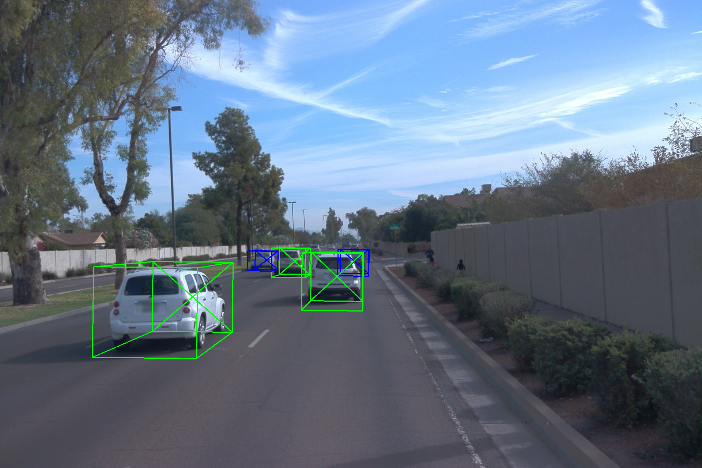
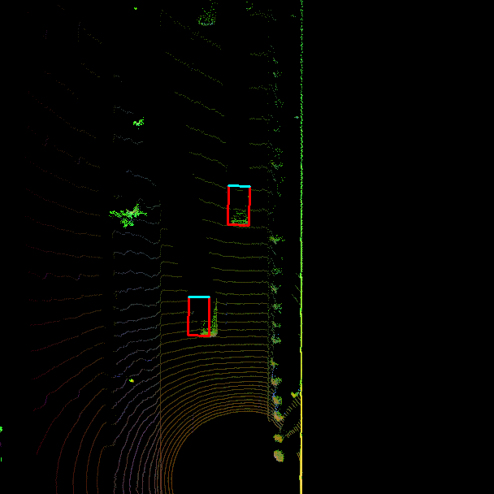

# Camera-Lidar Sensor Fusion
### Introduction to Autonomous Mobile Vehicles · Waymo Open Dataset

<div align="center">


</div>

---

## Pipeline Overview

```
Raw Sensor Data (Waymo .tfrecord)
         │
         ▼
┌─────────────────────┐
│  Step 1             │  FPN-ResNet-18 on BEV lidar
│  3D Object          │  + front-camera detection
│  Detection          │
└────────┬────────────┘
         │  detections [x, y, z, h, w, l, yaw]
         ▼
┌─────────────────────┐
│  Step 2             │  6-DOF constant-velocity model
│  Extended           │  F, Q, H, R matrices (6D)
│  Kalman Filter      │  predict() → update()
└────────┬────────────┘
         │  state estimate x, covariance P
         ▼
┌─────────────────────┐
│  Step 3             │  initialized → tentative → confirmed
│  Track              │  Score-based + P-based deletion
│  Management         │
└────────┬────────────┘
         │  confirmed tracks
         ▼
┌─────────────────────┐
│  Step 4             │  Mahalanobis distance matrix
│  SNN Data           │  Chi-squared gating (df=6)
│  Association        │  Greedy nearest-neighbor
└────────┬────────────┘
         │  track ↔ measurement pairs
         ▼
┌─────────────────────┐
│  Step 5             │  Nonlinear camera model h(x)
│  Camera-Lidar       │  Joint lidar + camera EKF update
│  Sensor Fusion      │
└────────┬────────────┘
         │
         ▼
┌─────────────────────┐
│  Step 6             │  TTC + distance-based
│  Safety Score       │  SAFE / CAUTION / DANGER
│  Extension          │
└─────────────────────┘
```

---

## Results at a Glance

| Step | Configuration | Result | Target |
|:----:|:-------------|:------:|:------:|
| 2 — EKF | Seq 2, frames 150–200, `lim_y=[-5,10]` | **0.21 m RMSE** | ≤ 0.35 m ✅ |
| 3 — Track Mgmt | Seq 2, frames 65–100, `lim_y=[-5,15]` | **Deleted @ frame 97** | init→confirm→delete ✅ |
| 4 — Association | Seq 1, frames 0–200, `lim_y=[-25,25]` | **3 tracks · 0.12–0.19 m** | ≤ 0.35 m ✅ |
| 5 — Fusion | Seq 1, frames 0–200, camera+lidar | **3 tracks · 0.09–0.17 m** | < 0.25 m ✅ |

---

## Detection Samples

| Camera View | BEV Lidar |
|:-----------:|:---------:|
|  |  |

---

## RMSE Plots

<table>
  <tr>
    <td align="center"><b>Step 2 — EKF</b><br></td>
    <td align="center"><b>Step 3 — Track Management</b><br></td>
  </tr>
  <tr>
    <td align="center"><b>Step 4 — Data Association</b><br></td>
    <td align="center"><b>Step 5 — Camera-Lidar Fusion</b><br></td>
  </tr>
</table>

---

## Safety Score Extension (Step 6)


---

## File Structure

```
project2026/
├── student/
│   ├── filter.py            # EKF — predict(), update(), F(), Q(), gamma(), S()
│   ├── trackmanagement.py   # Track class + Trackmanagement (score, state, deletion)
│   ├── association.py       # SNN — associate(), get_closest_track_and_meas()
│   ├── measurements.py      # Sensor — in_fov(), get_hx(); Measurement class
│   ├── objdet_detect.py     # FPN-ResNet detection pipeline
│   ├── objdet_pcl.py        # Point-cloud → BEV
│   └── safety_score.py      # Step 6 extension
├── misc/
│   ├── params.py            # All tunable parameters
│   ├── evaluation.py        # RMSE plot, tracking movie
│   └── objdet_tools.py      # BEV utils, projection helpers
├── results/                 # All output plots, movie, detection PNGs
├── loop_over_dataset.py     # Main entry point
└── writeup.md               # Project report
```

---

## How to Run Each Step

> **Environment:** `conda activate fusion`

### Step 1 — Object Detection
```python
# loop_over_dataset.py settings:
data_filename = '...10072231702153043603_5725_000_5745_000...'  # Sequence 2
show_only_frames = [150, 200]
configs_det.lim_y = [-5, 10]
exec_detection    = ['bev_from_pcl', 'detect_objects']
exec_tracking     = ['perform_tracking']
exec_visualization = ['show_tracks']
```
```bash
conda run -n fusion python loop_over_dataset.py
```

---

### Step 2 — Extended Kalman Filter
```python
# Same as Step 1 — fresh detections required for clean single-track result
exec_detection = ['bev_from_pcl', 'detect_objects']
exec_tracking  = ['perform_tracking']
```
Expected: **single confirmed track, mean RMSE ≤ 0.35 m**

---

### Step 3 — Track Management
```python
data_filename  = '...10072231702153043603_5725_000_5745_000...'  # Sequence 2
show_only_frames = [65, 100]
configs_det.lim_y = [-5, 15]
exec_detection = []               # load from cache
exec_tracking  = ['perform_tracking']
```
Expected: **"deleting track no. 0"** in console at frame ~97

---

### Step 4 — Data Association
```python
data_filename  = '...1005081002024129653_5313_150_5333_150...'  # Sequence 1
show_only_frames = [0, 200]
configs_det.lim_y = [-25, 25]
exec_detection = []
exec_tracking  = ['perform_tracking']
```
Expected: **3 confirmed tracks, all RMSE ≤ 0.35 m, no ghost tracks**

---

### Step 5 — Camera-Lidar Fusion + Tracking Movie
```python
data_filename  = '...1005081002024129653_5313_150_5333_150...'  # Sequence 1
show_only_frames = [0, 200]
configs_det.lim_y = [-25, 25]
exec_detection    = []
exec_tracking     = ['perform_tracking', 'use_camera']
exec_visualization = ['show_tracks', 'load_image', 'make_tracking_movie']
```
Expected: **3 tracks, RMSE < 0.25 m, `results/my_tracking_results.avi` generated**

---

### Step 6 — Safety Score (runs automatically with Step 5)

Output: `results/step6_safety.png`

---

## Key Parameters (`misc/params.py`)

| Parameter | Value | Role |
|-----------|------:|------|
| `dt` | 0.1 s | Timestep |
| `q` | 3 | Process noise spectral density |
| `window` | 6 | Score window |
| `confirmed_threshold` | 0.8 | Score → confirmed |
| `delete_threshold` | 0.6 | Score → deleted (confirmed) |
| `max_P` | 9 | Covariance → deleted |
| `sigma_cam_i / j` | 5 px | Camera measurement noise |

---

## Author

**Fatih Öztürk** — MKT4846, June 2026  

