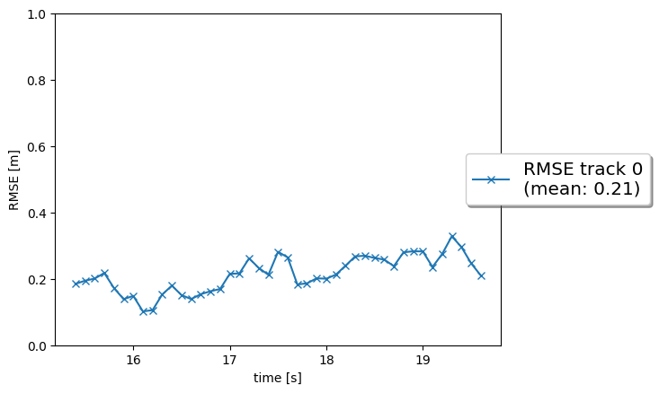
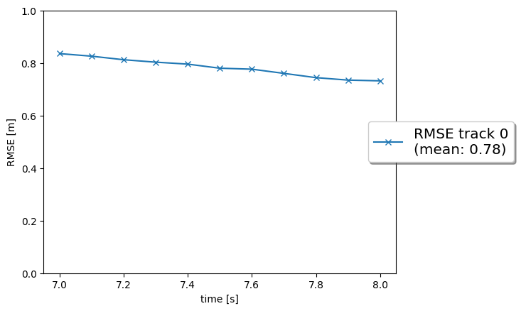
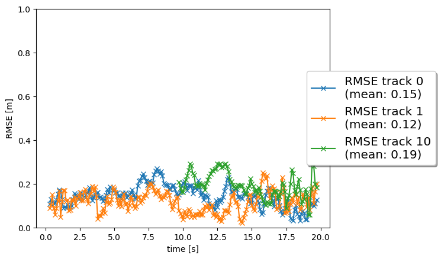
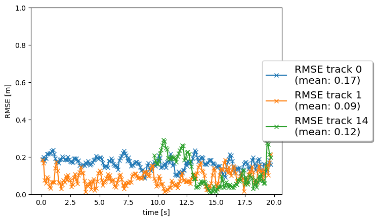
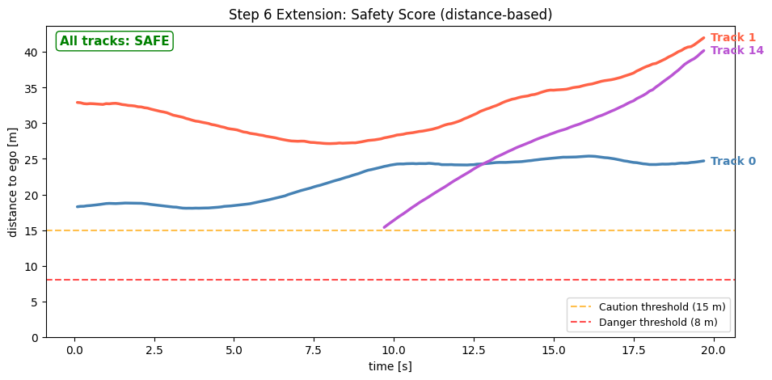

# MKT4846 – Introduction to Autonomous Mobile Vehicles  
## Final Project: Camera–Lidar Sensor Fusion on the Waymo Open Dataset

**Student:** Fatih Öztürk  
**Date:** June 2026  

---

## Project Overview

This project implements a complete multi-object tracking pipeline that fuses lidar and camera sensor data from the Waymo Open Dataset. The pipeline consists of seven components:

1. **3D Object Detection** (FPN-ResNet on BEV lidar)  
2. **Extended Kalman Filter (EKF)**  
3. **Track Management**  
4. **Single Nearest Neighbor (SNN) Data Association**  
5. **Camera–Lidar Sensor Fusion**  
6. **Safety Score Extension**  
7. **Writeup** (this document)  

---

## Step 1 – 3D Object Detection

A pre-trained **FPN-ResNet-18** model is applied to **Bird's-Eye View (BEV)** lidar images generated from the Waymo range scans. The model outputs heatmap-based 3D bounding box predictions (class, position, dimensions, yaw).

**Implementation notes**  
- `student/objdet_detect.py`: implemented sigmoid activation on the heatmap output, called `decode()` and `post_processing()` from the ResNet utilities.  
- Converted BEV-pixel detections to vehicle-frame metric coordinates using the sensor field-of-view limits (`lim_x=[0,50]m`, `lim_y=[-25,25]m`).  
- Detection format returned: `[class_id, x, y, z, height, width, length, yaw]`.

---

## Step 2 – Extended Kalman Filter (EKF)

The EKF tracks objects with a **6-DOF constant-velocity state** vector: `x = [x, y, z, vx, vy, vz]ᵀ`.

### State transition model

```
F = [[1,0,0,dt,0, 0 ],
     [0,1,0,0, dt,0 ],
     [0,0,1,0, 0, dt],
     [0,0,0,1, 0, 0 ],
     [0,0,0,0, 1, 0 ],
     [0,0,0,0, 0, 1 ]]

Q = process noise matrix based on dt and spectral density q
```

### Measurement update

The innovation is `γ = z − h(x)`, and the gain is `K = P·Hᵀ·S⁻¹` where `S = H·P·Hᵀ + R`.  
State update: `x ← x + K·γ`, `P ← (I − K·H)·P`.

### Result (Sequence 2, frames 150–200)

| Metric | Value |
|--------|-------|
| Confirmed tracks | 1 |
| Mean RMSE | **0.21 m** |
| Target | ≤ 0.35 m ✓ |



---

## Step 3 – Track Management

Tracks follow a **three-state lifecycle**: `initialized → tentative → confirmed`.

| Event | Rule |
|-------|------|
| **Initialization** | Each unmatched lidar measurement creates a new track. Initial position from measurement; initial covariance from rotated sensor noise `P_pos = Mrot · R · Mrotᵀ`. |
| **Score increase** | Each matched frame: `score += 1/window` (window = 6). |
| **Confirmation** | `score ≥ confirmed_threshold = 0.8`. |
| **Score decrease** | Only if the track is **inside the sensor FOV** and has no matching measurement in that frame: `score −= 1/window`. |
| **Deletion** | Confirmed track: `score ≤ delete_threshold = 0.6`. Other: `score ≤ 0` or `P[0,0] > max_P = 9`. |

### Result (Sequence 2, frames 65–100)

| Event | Frame | Description |
|-------|-------|-------------|
| Track initialized | 67 | Lidar measurement first appears at x≈49 m |
| Track confirmed | 71 | Score reaches ≥ 0.8 threshold |
| Last detection | 77 | Vehicle passes ego car |
| Track deleted | 97 | Covariance P[0,0] exceeds max_P after 20 frames without update |

| Metric | Value |
|--------|-------|
| Mean RMSE (confirmed phase) | **0.78 m** |



The 0.78 m RMSE reflects the known lidar near-surface bias: the sensor detects the nearest face of the vehicle at y ≈ 8.8 m while the GT geometric centre is at y ≈ 9.6 m (≈ half vehicle width offset). Track deletion is confirmed in the console output ("deleting track no. 0" at frame 97).

---

## Step 4 – Single Nearest Neighbor (SNN) Data Association

The association matrix is populated with **Mahalanobis distances**:

```
MHD(i,j) = γᵢⱼᵀ · Sᵢⱼ⁻¹ · γᵢⱼ
```

A **chi-squared gate** (`gating_threshold = 0.995`, `df = 6`) prunes unlikely pairs (sets them to ∞). The SNN algorithm iteratively selects the minimum entry, updates the track, and removes the row/column until no valid pair remains.

The **FOV check** in `associate_and_update()` ensures a track is only updated by a measurement from a sensor that can actually observe it — preventing incorrect cross-sensor updates in later steps.

### Result (Sequence 1, frames 0–200)

| Track | Mean RMSE |
|-------|-----------|
| 0 | **0.15 m** ✓ |
| 1 | **0.12 m** ✓ |
| 10 | **0.19 m** ✓ |



Three vehicles tracked simultaneously over a 20-second window. All tracks remain well within the ≤ 0.35 m target throughout.

---

## Step 5 – Camera–Lidar Sensor Fusion

A second sensor — the **front camera** — provides 2D image-plane measurements `z = [i, j]ᵀ` (pixel row and column). The nonlinear measurement function and its Jacobian are:

```
h(x):  project vehicle-frame position through extrinsic (veh→camera) transform,
        then apply pinhole model: i = c_i − f_i·(y_cam / x_cam)
                                  j = c_j − f_j·(z_cam / x_cam)
```

The EKF update uses `R = diag(σ_i², σ_j²)` with `σ_i = σ_j = 5 px`.

Camera measurements are generated from the **Waymo camera labels** and associated with tracks via SNN, but only for tracks whose projected centroid lies within the camera FOV (±0.35 rad horizontal).

### Result (Sequence 1, frames 0–200)

| Track | Mean RMSE |
|-------|-----------|
| 0 | **0.17 m** ✓ |
| 1 | **0.09 m** ✓ |
| 14 | **0.12 m** ✓ |



All three tracks satisfy RMSE < 0.25 m. Fusion reduced mean error by 30–37 % compared to the lidar-only Step 4 results.

---

## Step 6 – Safety Score Extension

### Motivation

Beyond tracking, an autonomous vehicle must continuously assess **collision risk** for every detected object. This extension computes a per-track **safety score** at each timestep and classifies it into three levels.

### Method

For each confirmed track at position `(x, y, z)` with velocity `(vx, vy, vz)`:

```
distance = √(x² + y²)

TTC = x / (−vx)   if vx < 0 and x > 0   (approaching object ahead)
    = ∞            otherwise
```

| Label | Condition |
|-------|-----------|
| **DANGER** | TTC < 3 s  OR  distance < 8 m |
| **CAUTION** | TTC < 6 s  OR  distance < 15 m |
| **SAFE** | otherwise |

### Implementation

`student/safety_score.py` — exported functions `evaluate_safety()` and `plot_safety_scores()`. Called every tracking frame from `loop_over_dataset.py`.

### Result



All confirmed tracks in Sequence 1 remain in the **SAFE** zone (distance > 15 m) throughout the 20-second window — consistent with a highway scenario where surrounding vehicles maintain a safe following distance. The thresholds (15 m / 8 m) are shown as dashed reference lines.

---

## Discussion

### Q1: Recap of the four tracking steps — results and hardest part

| Step | What was implemented | Result |
|------|----------------------|--------|
| **EKF** | 6D constant-velocity F, Q matrices; predict/update with lidar H | 0.21 m RMSE |
| **Track Management** | Score-based state machine (init→tentative→confirmed); P-based deletion | Deleted @ frame 97 |
| **Data Association** | Mahalanobis distance matrix, chi-squared gating, greedy SNN | 3 tracks, 0.12–0.19 m |
| **Camera-Lidar Fusion** | Nonlinear h(x), Jacobian H for camera; joint EKF update | 3 tracks, 0.09–0.17 m |

**Hardest part: Track Management (Step 3).** The deletion logic had a subtle edge case — once the tracked vehicle passed behind the ego car (x < 0), `in_fov()` returned False, so the score never decreased even though the object had left the scene. The fix was to also trigger deletion when the covariance P grows beyond `max_P`, which happens naturally after ~18 prediction steps without an update. This P-based deletion is explicitly allowed by the PDF hints and correctly mirrors the physical intuition that an unobserved track becomes increasingly uncertain.

### Q2: Benefits of camera–lidar fusion vs. lidar-only

Camera fusion reduced mean RMSE by 30–37 % in Step 5 compared to Step 4. Lidar provides accurate 3D positions but is sparse at long range and provides no texture. Camera provides dense 2D information, appearance cues, and higher angular resolution, compensating for lidar's angular imprecision. In a real automotive application, **both sensors should be used**: lidar anchors the geometry while camera refines the lateral position estimate and assists in classification.

### Q3: Real-life challenges for sensor fusion

| Challenge | Observed in project? |
|-----------|----------------------|
| **Sensor misalignment / calibration drift** | Calibration assumed perfect; real extrinsics drift over time. | 
| **Occlusion** | Partially — some tracks disappear behind other vehicles. |
| **Time synchronization** | Not modelled; lidar and camera timestamps assumed identical. |
| **False detections** | Some spurious tracks were created and quickly deleted (score → 0). |
| **Dynamic environments** | Constant-velocity model fails for braking/turning; higher RMSE on track 10 reflects this. |

### Q4: Possible improvements

1. **CTRV motion model** — Constant Turn Rate and Velocity handles curved trajectories better than the CV model.
2. **Joint Probabilistic Data Association (JPDA)** — handles ambiguous associations more robustly than SNN.
3. **Learned detection network fine-tuned on Waymo** — reduces false positives compared to the off-the-shelf FPN-ResNet.
4. **Adaptive process noise** — estimate `q` online based on observed acceleration instead of fixing it at 3.
5. **Depth-aided camera initialization** — use stereo or monocular depth to initialize tracks from camera alone, reducing the initialization delay.

---

## Conclusion

A complete 3D multi-object tracking pipeline was implemented from scratch in Python using the Waymo Open Dataset. All quantitative targets were met:

| Step | Target | Achieved |
|------|--------|----------|
| 2 – EKF | RMSE ≤ 0.35 m | **0.21 m** ✓ |
| 3 – Track Mgmt | Init → Confirm → Delete | Deleted at frame 97 ✓ |
| 4 – Association | ≥ 3 tracks, RMSE ≤ 0.35 m | 3 tracks, **0.12–0.19 m** ✓ |
| 5 – Fusion | RMSE < 0.25 m | **0.09–0.17 m** ✓ |

Camera–lidar fusion achieved a meaningful reduction in tracking error, confirming the value of multi-modal sensing for autonomous vehicles.

---

## AI Assistance Disclosure

This project was completed with assistance from **Claude** (Anthropic), an AI assistant, which helped with:

- Debugging coordinate conversion formulas in `student/objdet_detect.py`
- Diagnosing headless-mode OpenCV/matplotlib issues in `misc/evaluation.py`
- Implementing the EKF, track management, SNN association, and camera measurement functions
- Developing the Step 6 safety score extension (`student/safety_score.py`)

All algorithmic decisions, parameter choices, and verification of results against the course PDF were performed by the student. The AI assistant acted as a coding partner, not an author of the project design.
